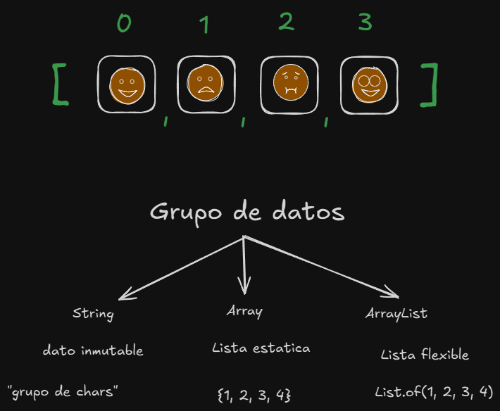

# 📘 Clase 03 | Cadenas y Listas

---

## 📑 Índice

### Clase 03 | Cadenas y listas
- Manipulación de cadenas de caracteres.
- Métodos comunes de cadenas.
- Introducción a arrays y listas.
- Uso de ArrayList y sus métodos.

### Clase 04 | Funciones y Modularización
- Concepto de funciones (métodos) en Java.
- Declaración y llamada de funciones.
- Parámetros y argumentos.
- Paso por valor y referencia.
- Sobrecarga de métodos.
- Buenas prácticas de modularización.

---

## 🎯 Objetivos de la Clase
- Comprender cadenas de caracteres en Java.
- Aprender las principales operaciones para manipular strings.
- Introducir arrays y sus limitaciones.
- Explorar el uso de arrays para almacenar colecciones de datos.
- Conocer listas dinámicas (ArrayList).
- Resolver problemas concretos del catálogo de productos en TechLab.

---

## 📝 Manejo de Strings

### 🔹 Manipulación de cadenas de caracteres
Las cadenas de caracteres (Strings) son uno de los tipos de datos más importantes y utilizados en Java.  
Un aspecto crucial de las cadenas en Java es su **inmutabilidad**: una vez creada, su contenido no puede modificarse.

**Beneficios de la inmutabilidad:**
- Seguridad en aplicaciones multihilo.
- Mejor rendimiento del pool de strings.
- Prevención de modificaciones accidentales.

### Ejemplo: Inmutabilidad

```java
String nombre = "Juan";
nombre.toUpperCase();
// nombre sigue siendo "Juan"

nombre = nombre.toUpperCase();
// Ahora sí, nombre es "JUAN"
```

El método `.toUpperCase()` devuelve una **nueva cadena**, pero no modifica el objeto original.

---

### Ejemplo: Formateo de nombres de productos
```java
String producto = " Café Premium MOLIDO ";
producto = producto.trim().toLowerCase();
// Resultado: "café premium molido"
```

### Formateo avanzado (Title Case)
```java
public static String formatearNombreProducto(String nombre) {
    nombre = nombre.trim().toLowerCase();
    String[] palabras = nombre.split(" ");
    StringBuilder sb = new StringBuilder();
    for (String palabra : palabras) {
        if (!palabra.isEmpty()) {
            sb.append(Character.toUpperCase(palabra.charAt(0)))
              .append(palabra.substring(1))
              .append(" ");
        }
    }
    return sb.toString().trim();
}
```

Entrada: `"caFÉ PREMIUM molido"`  
Salida: `"Café Premium Molido"`

---

## 🔹 Arrays

Los arrays son una **estructura de datos fundamental** en Java que permite almacenar múltiples elementos del mismo tipo.

### Ejemplo:
```java
String[] productos = new String[3];
productos[0] = "Café Premium Molido";
productos[1] = "Té Verde Orgánico";
productos[2] = "Chocolate Amargo 80%";

for (int i = 0; i < productos.length; i++) {
    System.out.println("Producto: " + productos[i]);
}
```

**Salida esperada:**
```
Producto: Café Premium Molido
Producto: Té Verde Orgánico
Producto: Chocolate Amargo 80%
```

> ⚠️ **Nota:** Los arrays tienen un tamaño **fijo** que no puede cambiarse en tiempo de ejecución.

---

## 🔹 ArrayList

`ArrayList` es una lista **dinámica** que puede crecer o decrecer según sea necesario.  
Métodos útiles: `add()`, `remove()`, `get()`, `size()`, `contains()`.

### Ejemplo:
```java
ArrayList<String> listaProductos = new ArrayList<>();
listaProductos.add("Café Premium Molido");
listaProductos.add("Té Verde Orgánico");
listaProductos.add("Chocolate Amargo 80%");

for (String producto : listaProductos) {
    System.out.println(producto);
}
```

### Ejemplo práctico: Actualización dinámica
```java
ArrayList<String> listaProductos = new ArrayList<>();
listaProductos.add("Café Premium Molido");
listaProductos.add("Té Verde Orgánico");
listaProductos.add("Chocolate Amargo 80%");

// Agregar nuevo producto
listaProductos.add("Café Descafeinado");

// Eliminar producto
listaProductos.remove("Chocolate Amargo 80%");

// Verificar existencia
if (listaProductos.contains("Té Verde Orgánico")) {
    System.out.println("El producto existe");
}
```

---

## Ejemplo Diagrama en Clase

---

## 💡 Recursos Adicionales
- [📄 Documentación Oficial de Java](https://docs.oracle.com/javase/8/docs/api/)
- Tutoriales en YouTube sobre Strings y ArrayList.
- Libros de programación en Java para ampliar conocimientos.

---

## 📝 Ejercicios Prácticos

### Situación en TechLab
Silvia (PO) recibe solicitudes del cliente “Sibelius” relacionadas con el catálogo de productos.

1. Algunos nombres vienen con espacios extra o mayúsculas/minúsculas inconsistentes → **Formatear cadenas.**
2. Necesitan almacenar varios productos → **Usar Arrays.**
3. Requieren agregar/quitar productos dinámicamente → **Usar ArrayList.**

---

### Ejercicio Obligatorio

#### 🔹 Manipulación de Cadenas
- Dada la cadena `" té CHAi "`, formatearla para que quede `"Té Chai"`.
- Mostrar su **longitud**, su **primera letra** y verificar si **contiene la palabra "Chai"**.

#### 🔹 Arrays
- Crear un array de **5 productos**.
- Imprimir sus elementos.
- Intentar agregar un sexto producto (analizar el resultado).

#### 🔹 ArrayList
- Crear un `ArrayList<String>` de productos.
- Agregar varios productos, eliminar uno, verificar si otro existe e imprimir la lista final.

#### 🔹 Combinar Cadenas y Listas
- Tener una lista de productos con nombres desprolijos.
- Crear un **método** que recorra la lista, aplique el formateo a cada nombre y vuelva a imprimir la lista con nombres prolijos.

---

## 📦 Reflexiones Finales
- **Inmutabilidad de Strings:** Garantiza seguridad y eficiencia.
- **Arrays vs ArrayList:** Usar arrays para datos de tamaño fijo y ArrayList para listas dinámicas.
- **Impacto en Proyectos:** Mejor organización y escalabilidad para el catálogo TechLab.
